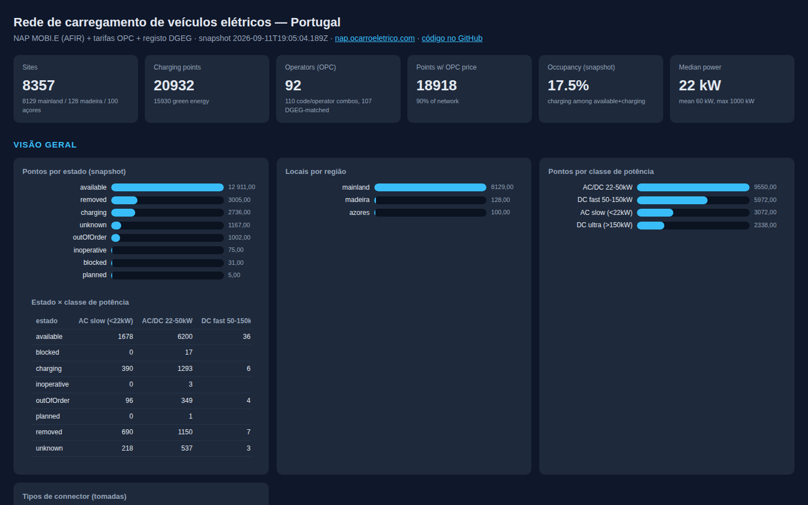

# NAP MOBI.E — EV charging network (Portugal)

POC (proof of concept) analysis of Portugal's EV charging network from official
public data sources. The goal:

- Extract and cross-reference data from several sources (NAP MOBI.E, OPC tariff,
  DGEG registries, OSM/umap)
- Build a **self-contained local dashboard** (`dashboard.html`) to explore the network
- Produce a list of **interesting facts** and a list of **reportable errors** for
  the data owners



## Data sources

| Source | Description | File |
|-------|-----------|----------|
| NAP MOBI.E (DATEX II 3.3) | Static inventory of sites/points | `evChargingInfra_latest.xml` |
| NAP MOBI.E (DATEX II 3.3) | Dynamic status (state, prices) | `evActualStatus_latest.xml` |
| MOBI.E OPC tariff | Per-point tariffs (€/kWh, €/min, flat fee) | `mobie_tarifas.csv` |
| MOBI.E PartyID (PDF) | Official operator/CEME codes | `mobie_partyid.pdf` |
| DGEG | Recognized OPC and CEME lists | `dgeg_opc.csv`, `dgeg_ceme.csv` |
| OSM/umap (community) | Overpass dump of the "Postos de Carregamento v2.1" map + "Caça aos Postos" umap | `umap_cache/`, `osm_umap.csv` |

## Results

- **`dashboard.html`** — standalone dashboard (9.4 MB), no external libraries,
  opens via `file://`. KPIs, bar charts, an **interactive SVG map** of 8 260 sites
  (mainland + Madeira/Açores, zoom/pan, click a dot for detail with OSM
  cross-reference), a 20 521-point table with search, multi-select filters
  (status/region/power class/operator/connector/payment), click-to-sort headers
  and pagination.
- **`facts.md`** — interesting facts about the network.
- **`errors.md`** — errors worth reporting to the data owners (includes community
  OSM/umap doubts and operator/payment divergences).

## Running

Requires Python 3.11+ with `pandas` and `lxml` (plus `pdfplumber` for the PartyID
PDF). On machines where system pip is blocked (e.g. PEP 668), use a venv:

```bash
python3 -m venv venv
venv/bin/pip install pandas lxml pdfplumber
```

Pipeline (in dependency order):

```bash
bash scripts/fetch_data.sh            # download fresh data from official origins
venv/bin/python scripts/nap_etl.py    # NAP XML -> static/dynamic CSVs
venv/bin/python scripts/check_quality.py   # quality validation
venv/bin/python scripts/summary.py         # numeric summary
venv/bin/python scripts/mobie_join.py      # join NAP + MOBI.E tariff -> nap_opc_points.csv
venv/bin/python scripts/dgeg_lists.py      # DGEG OPC/CEME from the web pages
venv/bin/python scripts/dgeg_crossref.py   # resolve OPC codes -> DGEG entities
venv/bin/python scripts/partyid_crossref.py # cross-reference with the PartyID PDF
venv/bin/python scripts/concelho_check.py    # validate coordinates vs CAOP concelho
venv/bin/python scripts/osm_umap.py          # cross-reference NAP with OSM/umap (community)
venv/bin/python scripts/make_pt_outline.py   # generate assets/pt_outline.json (map)
venv/bin/python scripts/build_dashboard.py # generate dashboard.html, facts.md, errors.md
```

`build_dashboard.py` reads all intermediate CSVs and injects the data into the
template `assets/dashboard_template.html`, replacing the `/*__DATA__*/` marker.
It also regenerates `dashboard.png` (headless Chrome screenshot) for this README;
if Chrome is missing it warns and skips.

## Main files

| File | Role |
|----------|------|
| `scripts/nap_etl.py` | NAP XML parser (static + dynamic) to CSV |
| `scripts/mobie_join.py` | NAP↔MOBI.E join by `site_external_id` + plug |
| `scripts/dgeg_crossref.py` | OPC code → entity resolution (fuzzy match) |
| `scripts/partyid_crossref.py` | Enrichment with the official PartyID |
| `scripts/concelho_check.py` | Coordinate validation vs CAOP concelho boundaries |
| `scripts/osm_umap.py` | Community OSM/umap cross-check (operators, payment, doubts) |
| `scripts/make_pt_outline.py` | Portugal outline for the SVG map (from CAOP) |
| `scripts/check_quality.py` | Physical/schema sanity checks |
| `scripts/build_dashboard.py` | Generates the standalone dashboard + facts/errors |
| `assets/dashboard_template.html` | Dashboard HTML/JS template (`/*__DATA__*/` marker) |
| `assets/pt_outline.json` | PT outline polygons + district/island labels for the map (143 KB) |
| `assets/schemas/*.xsd` | DATEX II 3.3 schemas (enum source) |
| `SKILL.md` | Reusable skill with all knowledge and the pipeline |

## Intermediate data (CSV)

`sites`, `points`, `status`, `pricing` (NAP output), `nap_opc_points` (NAP
+tariffs), `nap_opc_registry` (OPC code→entity), `mobie_tarifas`, `dgeg_*`, `mobie_partyid`.

## Engineering notes / pitfalls

- The NAP↔MOBI.E join uses `site_external_id` (= MOBI.E id) + the last segment of
  `point_id` (the plug, int-normalized). **Do not** join on raw `point_external_id`:
  the `PT*op*[E]*reg*num*tom` format is inconsistent (glued `E` prefix, variable
  segment count).
- `brands_accepted` in NAP is the per-point global CEME list, **not** an operator
  discriminator.
- `facilityLocation` lives in the `locationReferencing` namespace, not in
  `locationExtension`.
- Static CSVs are read with `dtype=str` to avoid losing leading zeros.
- Embedded dashboard JSON: use `allow_nan=False` plus NaN/Inf cleaning, otherwise
  the browser's `JSON.parse` fails (bug already fixed).
- OSM/umap: the v2.1 map author's dump (`Todos.json`) covers ~96% of NAP sites
  (7 934/8 260) by MOBI.E code; `man_made=charge_point` nodes carry payment tags
  that `charging_station` elements lack — consider both. The "Caça aos Postos"
  umap lists community doubts, including "nothing on site" points ≤500 m from
  active NAP sites.
